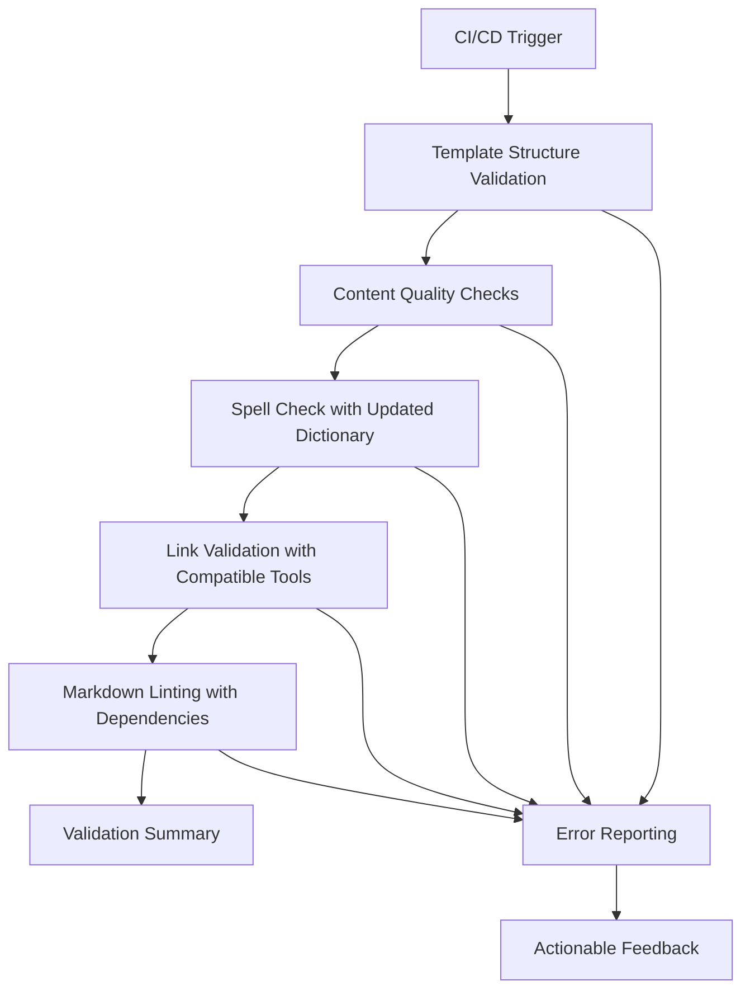

# Design Document

## Overview

This design addresses the systematic resolution of CI/CD validation failures through a multi-phase approach that fixes immediate issues while improving long-term pipeline robustness. The solution focuses on compatibility, consistency, and maintainability.

## Architecture

### Validation Pipeline Structure


## Components and Interfaces

### 1. Spell Check Enhancement
- **Updated Dictionary**: Comprehensive .cspell.json with all technical terms
- **Categorized Terms**: Organized by domain (SDD, AI, tools, etc.)
- **Maintenance Process**: Clear guidelines for adding new terms

### 2. Link Validation Compatibility
- **Node.js Version Management**: Use compatible markdown-link-check version
- **Fallback Strategy**: Alternative validation approach if primary tool fails
- **Configuration Updates**: Improved .markdown-link-check.json settings

### 3. Dependency Management
- **Package.json Creation**: Minimal package.json for Node.js dependencies
- **Version Pinning**: Specific versions to avoid compatibility issues
- **Caching Strategy**: Efficient dependency caching in CI/CD

### 4. Template Structure Fixes
- **Requirement References**: Add missing "_Requirements:" sections
- **Consistency Checks**: Automated validation of template structure
- **Documentation Updates**: Clear guidelines for template maintenance

## Data Models

### Spell Check Dictionary Structure
```json
{
  "version": "0.2",
  "language": "en",
  "words": [
    // Core SDD Terms
    "SDD", "Spec-Driven", "ChatPRD", "Kiro",
    
    // AI and Tools
    "AI", "LLM", "GitHub", "Copilot", "Claude",
    
    // Technical Terms
    "API", "OAuth", "TOTP", "JWT", "WCAG",
    
    // Development Terms
    "frontend", "backend", "fullstack", "DevOps"
  ]
}
```

### Package.json Dependencies
```json
{
  "name": "sdd-blueprint-validation",
  "version": "1.0.0",
  "devDependencies": {
    "markdown-link-check": "^3.11.2",
    "markdownlint-cli": "^0.37.0",
    "cspell": "^7.3.8"
  }
}
```

## Error Handling

### Graceful Degradation
- Continue validation even if individual steps fail
- Provide comprehensive error reporting
- Offer alternative validation methods

### Error Categories
1. **Critical**: Must be fixed before merge
2. **Warning**: Should be addressed but don't block
3. **Info**: Suggestions for improvement

## Testing Strategy

### Validation Testing
- Test each validation step independently
- Verify compatibility across Node.js versions
- Validate error handling and reporting

### Integration Testing
- Full pipeline execution
- Cross-platform compatibility
- Performance impact assessment

## Implementation Phases

### Phase 1: Immediate Fixes
1. Update spell check dictionary with all identified terms
2. Fix Node.js compatibility for link validation
3. Add missing requirement references to templates
4. Create package.json with pinned dependencies

### Phase 2: Pipeline Improvements
1. Enhance error reporting and feedback
2. Add fallback validation strategies
3. Improve configuration management
4. Optimize performance and caching

### Phase 3: Long-term Maintenance
1. Automated dictionary updates
2. Template structure validation
3. Continuous compatibility monitoring
4. Documentation and guidelines updates