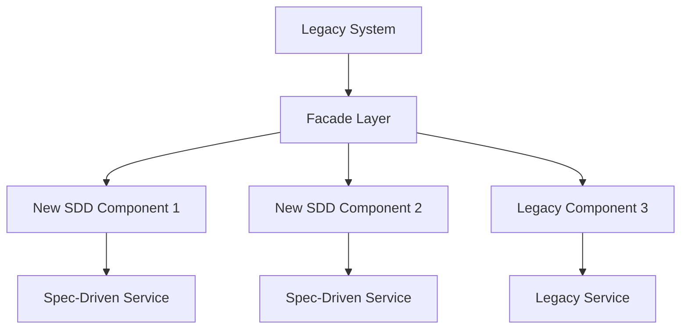

# Advanced SDD Workflows

## Complex Integration Scenarios

This guide covers sophisticated Spec-Driven Development patterns for experienced teams working with legacy systems, microservices, and complex integration requirements.

## Legacy System Integration

### Modernization Strategy

When integrating SDD with existing codebases, follow this systematic approach:

#### Phase 1: Assessment and Mapping
1. **Audit Existing Code**: Document current architecture and dependencies
2. **Identify Integration Points**: Map where new specs will interface with legacy code
3. **Create Boundary Specs**: Write specifications for the interface between old and new systems
4. **Plan Migration Strategy**: Determine which components to modernize first

#### Phase 2: Incremental Specification
```markdown
# Legacy Integration Spec Template

## Current State Analysis
- Existing functionality: [describe current behavior]
- Technical debt: [identify problematic areas]
- Dependencies: [map external dependencies]
- Performance characteristics: [document current performance]

## Target State Specification
- New functionality: [specify desired behavior]
- Integration approach: [describe how new connects to old]
- Migration path: [outline transition strategy]
- Rollback plan: [define fallback approach]

## Implementation Strategy
- Phase 1: [minimal viable integration]
- Phase 2: [feature parity]
- Phase 3: [enhanced functionality]
- Phase 4: [legacy retirement]
```

### Strangler Fig Pattern with SDD

Implement the strangler fig pattern using structured specifications:



1. **Create Facade Specification**: Define the interface that will gradually replace legacy functionality
2. **Implement Component Specs**: Write detailed specs for each new component
3. **Define Migration Tasks**: Create specific tasks for moving functionality from legacy to new system
4. **Establish Testing Strategy**: Ensure both old and new systems work during transition

## Microservices Architecture

### Service Boundary Definition

Use SDD to clearly define microservice boundaries and contracts:

#### Service Specification Template
```markdown
# [Service Name] Specification

## Service Responsibility
- Primary function: [single responsibility]
- Data ownership: [what data this service owns]
- Business capability: [business function served]

## API Contract
- Endpoints: [REST/GraphQL/gRPC interfaces]
- Data models: [request/response schemas]
- Error handling: [error codes and messages]
- Versioning strategy: [how API versions are managed]

## Dependencies
- Upstream services: [services this depends on]
- Downstream consumers: [services that depend on this]
- External systems: [third-party integrations]
- Shared resources: [databases, message queues, etc.]

## Non-Functional Requirements
- Performance: [latency, throughput requirements]
- Availability: [uptime requirements]
- Scalability: [scaling characteristics]
- Security: [authentication, authorization, data protection]
```

### Cross-Service Workflow Specification

For workflows spanning multiple services, create orchestration specs:

```markdown
# Cross-Service Workflow: [Workflow Name]

## Workflow Overview
- Trigger: [what initiates this workflow]
- Participants: [services involved]
- Success criteria: [how to determine success]
- Failure handling: [error recovery strategy]

## Step-by-Step Flow
1. **Service A**: [action and expected outcome]
   - Input: [data required]
   - Output: [data produced]
   - Error conditions: [possible failures]

2. **Service B**: [action and expected outcome]
   - Input: [data from previous step]
   - Output: [data produced]
   - Error conditions: [possible failures]

## Compensation Logic
- Rollback strategy: [how to undo partial completion]
- Retry policies: [when and how to retry failed steps]
- Circuit breaker: [when to stop trying]
```

## Multi-Team Coordination

### Specification Handoff Process

When multiple teams work on related components:

#### Team A (API Provider) Responsibilities
1. **Define API Contract**: Create detailed API specification
2. **Mock Implementation**: Provide working mocks for dependent teams
3. **Documentation**: Maintain up-to-date API documentation
4. **Versioning**: Communicate breaking changes in advance

#### Team B (API Consumer) Responsibilities
1. **Integration Specification**: Define how they'll use the API
2. **Error Handling**: Specify how they'll handle API failures
3. **Testing Strategy**: Define integration testing approach
4. **Feedback Loop**: Provide usage feedback to API team

#### Coordination Specification Template
```markdown
# Cross-Team Integration: [Integration Name]

## Teams Involved
- Provider team: [team providing the service/API]
- Consumer teams: [teams using the service/API]
- Stakeholders: [product owners, architects, etc.]

## Interface Contract
- API specification: [link to detailed API spec]
- Data models: [shared data structures]
- Error handling: [error codes and recovery strategies]
- SLA commitments: [performance and availability guarantees]

## Development Coordination
- Timeline: [key milestones and dependencies]
- Communication plan: [how teams will coordinate]
- Testing strategy: [integration testing approach]
- Deployment coordination: [how releases will be managed]

## Change Management
- Breaking change process: [how breaking changes are communicated]
- Versioning strategy: [how versions are managed]
- Deprecation policy: [how old versions are retired]
```

## Event-Driven Architecture

### Event Specification Framework

For systems using event-driven patterns, create comprehensive event specifications:

```markdown
# Event Specification: [Event Name]

## Event Definition
- Event type: [domain event, integration event, etc.]
- Producer: [service that publishes this event]
- Consumers: [services that subscribe to this event]
- Business meaning: [what this event represents]

## Event Schema
```json
{
  "eventId": "string (UUID)",
  "eventType": "[event-name]",
  "timestamp": "ISO 8601 datetime",
  "version": "semantic version",
  "data": {
    // Event-specific payload
  },
  "metadata": {
    "correlationId": "string",
    "causationId": "string",
    "source": "string"
  }
}
```

## Processing Requirements
- Idempotency: [how duplicate events are handled]
- Ordering: [whether event order matters]
- Retry policy: [how failed processing is handled]
- Dead letter handling: [what happens to unprocessable events]
```

### Saga Pattern Specification

For complex distributed transactions, specify saga workflows:

```markdown
# Saga Specification: [Saga Name]

## Saga Overview
- Business process: [what business process this saga implements]
- Participants: [services involved in the saga]
- Coordination type: [orchestration vs choreography]

## Saga Steps
1. **Step 1**: [action description]
   - Service: [responsible service]
   - Command: [command to execute]
   - Compensation: [how to undo this step]

2. **Step 2**: [action description]
   - Service: [responsible service]
   - Command: [command to execute]
   - Compensation: [how to undo this step]

## Failure Handling
- Compensation order: [order of rollback operations]
- Timeout handling: [what happens if steps timeout]
- Partial failure recovery: [how to handle partial completions]
```

## Performance and Scalability Specifications

### Performance Requirements Specification

```markdown
# Performance Specification: [Component Name]

## Performance Targets
- Response time: [P50, P95, P99 latency requirements]
- Throughput: [requests per second, transactions per minute]
- Concurrent users: [maximum concurrent load]
- Data volume: [maximum data size, growth projections]

## Scalability Requirements
- Horizontal scaling: [how the system scales out]
- Vertical scaling: [resource scaling characteristics]
- Auto-scaling triggers: [when to scale up/down]
- Resource limits: [maximum resource consumption]

## Performance Testing Strategy
- Load testing: [normal load scenarios]
- Stress testing: [peak load scenarios]
- Endurance testing: [sustained load scenarios]
- Spike testing: [sudden load increase scenarios]

## Monitoring and Alerting
- Key metrics: [what to measure]
- Alert thresholds: [when to trigger alerts]
- Dashboard requirements: [what to visualize]
- SLA monitoring: [how to track SLA compliance]
```

## Security Integration Patterns

### Security Specification Framework

```markdown
# Security Specification: [Component Name]

## Authentication Requirements
- Authentication method: [OAuth, JWT, API keys, etc.]
- Token management: [token lifecycle, refresh strategy]
- Multi-factor authentication: [when MFA is required]

## Authorization Requirements
- Access control model: [RBAC, ABAC, etc.]
- Permission granularity: [resource-level, operation-level]
- Privilege escalation: [how elevated access is handled]

## Data Protection
- Encryption at rest: [what data is encrypted, how]
- Encryption in transit: [TLS requirements, certificate management]
- Data classification: [sensitive data identification]
- Data retention: [how long data is kept, deletion policies]

## Security Testing
- Penetration testing: [scope and frequency]
- Vulnerability scanning: [automated security checks]
- Code security review: [secure coding practices]
- Compliance validation: [regulatory compliance checks]
```

## Deployment and Operations

### Deployment Specification

```markdown
# Deployment Specification: [Service Name]

## Deployment Strategy
- Deployment pattern: [blue-green, canary, rolling update]
- Environment progression: [dev → staging → production path]
- Rollback strategy: [how to revert deployments]
- Feature flags: [how features are controlled]

## Infrastructure Requirements
- Compute resources: [CPU, memory, storage requirements]
- Network requirements: [bandwidth, latency, security groups]
- Dependencies: [databases, message queues, external services]
- Configuration management: [how configuration is managed]

## Monitoring and Observability
- Health checks: [application health indicators]
- Metrics collection: [what metrics to collect]
- Logging strategy: [what to log, log levels, retention]
- Distributed tracing: [trace collection and analysis]

## Operational Procedures
- Startup procedures: [how to start the service]
- Shutdown procedures: [graceful shutdown process]
- Backup and recovery: [data backup and recovery procedures]
- Incident response: [how to handle service incidents]
```

## Next Steps

After mastering these advanced patterns:

1. **Contribute Patterns**: Share your successful patterns with the community
2. **Tool Integration**: Explore advanced AI agent coordination
3. **Metrics and Improvement**: Establish feedback loops for continuous improvement
4. **Training Others**: Help your team adopt these advanced practices

## Resources

- [Getting Started Guide](getting-started.md) - Basic SDD workflows
- [AI Integration Guide](ai-integration.md) - Multi-tool coordination
- [Troubleshooting Guide](troubleshooting.md) - Common issues and solutions
- [Decision Trees](../resources/decision-trees/) - Architectural decision guidance