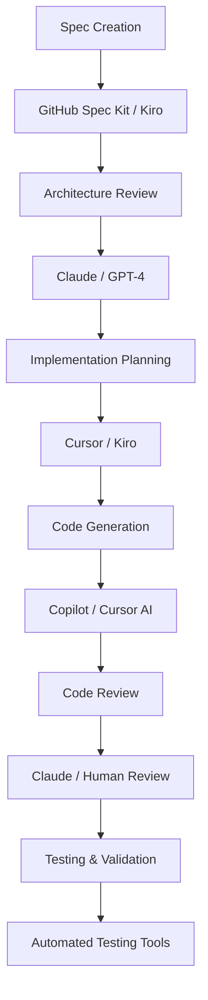

# AI Integration Guide

## Multi-Tool Setup and Optimization

This guide provides comprehensive setup instructions and best practices for integrating Spec-Driven Development with various AI coding assistants and development tools.

## Overview of AI Tool Ecosystem

### Primary AI Coding Assistants

| Tool | Strengths | Best Use Cases | SDD Integration Level |
|------|-----------|----------------|----------------------|
| **GitHub Copilot** | Code completion, context awareness | Real-time coding, autocomplete | Native with Spec Kit |
| **Claude (Anthropic)** | Complex reasoning, architecture | Spec review, system design | Excellent via API |
| **Cursor IDE** | AI-first development environment | Full workflow integration | Native SDD support |
| **Kiro** | Spec-driven workflows | End-to-end SDD implementation | Purpose-built for SDD |
| **ChatGPT/GPT-4** | General problem solving | Documentation, brainstorming | Good via prompting |

### Specialized Tools

- **GitHub Spec Kit**: CLI tool for spec-driven workflows
- **ChatPRD**: Product requirement to spec translation
- **Model Context Protocol (MCP)**: Cross-agent communication
- **Aider**: AI pair programming with git integration

## Tool-Specific Setup Guides

### GitHub Copilot + Spec Kit Integration

#### Installation and Setup

```bash
# Install GitHub Spec Kit CLI
npm install -g @github/spec-kit

# Initialize in your project
cd your-project
spec-kit init

# Configure for your tech stack
spec-kit config set --language typescript --framework express
```

#### Workflow Integration

1. **Create Spec with Spec Kit**:
   ```bash
   # Generate spec from template
   spec-kit spec create user-authentication
   
   # Edit the generated spec file
   code specs/user-authentication.md
   ```

2. **Generate Implementation Plan**:
   ```bash
   # Create technical plan from spec
   spec-kit plan generate specs/user-authentication.md
   
   # Break down into tasks
   spec-kit tasks create plans/user-authentication-plan.md
   ```

3. **Implement with Copilot**:
   ```bash
   # Start implementation session
   spec-kit implement tasks/user-authentication-tasks.md
   
   # Copilot will use spec context for suggestions
   ```

#### Copilot Configuration for SDD

```json
// .vscode/settings.json
{
  "github.copilot.enable": {
    "*": true,
    "yaml": false,
    "plaintext": false
  },
  "github.copilot.advanced": {
    "debug.overrideEngine": "copilot-codex",
    "debug.testOverrideProxyUrl": "",
    "debug.overrideProxyUrl": ""
  },
  "github.copilot.editor.enableAutoCompletions": true,
  "files.associations": {
    "*.spec.md": "markdown",
    "*.plan.md": "markdown",
    "*.tasks.md": "markdown"
  }
}
```

### Cursor IDE Native SDD Workflow

#### Setup and Configuration

1. **Install Cursor**: Download from [cursor.sh](https://cursor.sh)

2. **Configure SDD Workspace**:
   ```json
   // .cursor/settings.json
   {
     "cursor.ai.model": "gpt-4",
     "cursor.ai.enableCodeActions": true,
     "cursor.ai.enableInlineCompletion": true,
     "cursor.specDriven": {
       "enabled": true,
       "specDirectory": "./specs",
       "templateDirectory": "./templates"
     }
   }
   ```

3. **Create SDD Project Structure**:
   ```
   project/
   ├── specs/           # Specification files
   ├── plans/           # Technical plans
   ├── tasks/           # Implementation tasks
   ├── templates/       # Custom templates
   └── .cursor/         # Cursor configuration
   ```

#### Cursor SDD Workflow

1. **Spec Creation with AI Chat**:
   ```
   @cursor Create a specification for user authentication system with:
   - Email/password login
   - JWT token management
   - Password reset functionality
   - Rate limiting for security
   
   Use the template from templates/auth-spec.md
   ```

2. **Plan Generation**:
   ```
   @cursor Based on specs/user-auth.md, create a technical implementation plan that:
   - Uses Express.js and TypeScript
   - Integrates with existing PostgreSQL database
   - Follows our established error handling patterns
   - Includes comprehensive testing strategy
   ```

3. **Task-by-Task Implementation**:
   ```
   @cursor Implement task 2.1 from tasks/user-auth-tasks.md:
   "Create User model with validation"
   
   Context: Follow the patterns in src/models/BaseModel.ts
   Requirements: Email validation, password hashing, timestamps
   ```

### Claude Integration for Architecture Review

#### API Setup

```bash
# Install Claude API client
npm install @anthropic-ai/sdk

# Set up environment variables
export ANTHROPIC_API_KEY="your-api-key"
```

#### Architecture Review Workflow

```python
# scripts/claude-spec-review.py
import anthropic
import sys

def review_spec(spec_file_path):
    client = anthropic.Anthropic()
    
    with open(spec_file_path, 'r') as f:
        spec_content = f.read()
    
    prompt = f"""
    Please review this software specification for:
    1. Completeness and clarity
    2. Technical feasibility
    3. Security considerations
    4. Performance implications
    5. Integration challenges
    
    Specification:
    {spec_content}
    
    Provide specific, actionable feedback for improvement.
    """
    
    response = client.messages.create(
        model="claude-3-sonnet-20240229",
        max_tokens=2000,
        messages=[{"role": "user", "content": prompt}]
    )
    
    return response.content

if __name__ == "__main__":
    spec_file = sys.argv[1]
    review = review_spec(spec_file)
    print(review)
```

Usage:
```bash
# Review spec with Claude
python scripts/claude-spec-review.py specs/user-authentication.md
```

### Kiro IDE Native SDD Features

#### Project Setup

1. **Initialize SDD Project**:
   ```bash
   # Create new SDD project in Kiro
   kiro init --template sdd-project
   
   # Or add SDD to existing project
   kiro sdd init
   ```

2. **Configure SDD Preferences**:
   ```json
   // .kiro/sdd-config.json
   {
     "specFormat": "github-spec-kit",
     "aiProvider": "anthropic",
     "codeStyle": {
       "language": "typescript",
       "framework": "react",
       "testFramework": "vitest"
     },
     "workflows": {
       "autoGeneratePlans": true,
       "autoBreakdownTasks": true,
       "requireSpecReview": true
     }
   }
   ```

#### Kiro SDD Workflow

1. **Spec Creation**:
   - Use Kiro's built-in spec templates
   - AI-assisted requirement gathering
   - Automatic validation against best practices

2. **Plan Generation**:
   - Automatic technical plan generation from specs
   - Architecture decision recording
   - Integration point identification

3. **Task Management**:
   - Automatic task breakdown from plans
   - Progress tracking with requirement traceability
   - AI-assisted implementation guidance

### Model Context Protocol (MCP) Integration

#### MCP Server Setup

```json
// mcp-config.json
{
  "servers": {
    "spec-server": {
      "command": "node",
      "args": ["mcp-servers/spec-server.js"],
      "env": {
        "SPEC_DIR": "./specs",
        "PLAN_DIR": "./plans",
        "TASK_DIR": "./tasks"
      }
    },
    "code-server": {
      "command": "node", 
      "args": ["mcp-servers/code-server.js"],
      "env": {
        "SRC_DIR": "./src",
        "TEST_DIR": "./tests"
      }
    }
  }
}
```

#### Cross-Agent Communication

```javascript
// mcp-servers/spec-server.js
const { MCPServer } = require('@modelcontextprotocol/sdk');

class SpecServer extends MCPServer {
  async getSpec(specName) {
    // Return specification content
    return await fs.readFile(`specs/${specName}.md`, 'utf8');
  }
  
  async updateSpec(specName, content) {
    // Update specification with validation
    await this.validateSpec(content);
    await fs.writeFile(`specs/${specName}.md`, content);
  }
  
  async generatePlan(specName) {
    // Generate technical plan from spec
    const spec = await this.getSpec(specName);
    return await this.planGenerator.generate(spec);
  }
}
```

## Multi-Tool Coordination Strategies

### Tool Hierarchy and Responsibilities



### Workflow Orchestration

#### Sequential Workflow
```bash
#!/bin/bash
# sdd-workflow.sh - Orchestrated SDD workflow

# 1. Create spec with Spec Kit
spec-kit spec create $1

# 2. Review spec with Claude
python scripts/claude-spec-review.py specs/$1.md > reviews/$1-review.md

# 3. Generate plan
spec-kit plan generate specs/$1.md

# 4. Create tasks
spec-kit tasks create plans/$1-plan.md

# 5. Start implementation with Cursor/Copilot
echo "Ready for implementation. Open tasks/$1-tasks.md in your IDE."
```

#### Parallel Workflow
```yaml
# .github/workflows/sdd-pipeline.yml
name: SDD Pipeline
on:
  push:
    paths: ['specs/**']

jobs:
  validate-spec:
    runs-on: ubuntu-latest
    steps:
      - name: Validate spec format
        run: spec-kit validate specs/
      
  review-architecture:
    runs-on: ubuntu-latest
    steps:
      - name: Claude architecture review
        run: python scripts/claude-spec-review.py ${{ github.event.head_commit.modified }}
      
  generate-artifacts:
    needs: [validate-spec, review-architecture]
    runs-on: ubuntu-latest
    steps:
      - name: Generate plan and tasks
        run: |
          spec-kit plan generate specs/
          spec-kit tasks create plans/
```

## Best Practices for Multi-Tool Integration

### Context Management

1. **Shared Context Files**:
   ```markdown
   # .sdd/context.md
   ## Project Context
   - Technology Stack: React, Node.js, PostgreSQL
   - Architecture: Microservices with REST APIs
   - Code Style: TypeScript, ESLint, Prettier
   - Testing: Jest for unit tests, Cypress for E2E
   
   ## Current Sprint
   - Focus: User authentication system
   - Constraints: Must integrate with existing user database
   - Timeline: 2 weeks for MVP
   ```

2. **Tool-Specific Context**:
   ```json
   // .copilot/context.json
   {
     "codebase_context": {
       "primary_language": "typescript",
       "frameworks": ["react", "express"],
       "patterns": ["repository", "service", "controller"]
     },
     "current_feature": {
       "spec_file": "specs/user-auth.md",
       "plan_file": "plans/user-auth-plan.md",
       "current_task": "2.1 Create User model"
     }
   }
   ```

### Prompt Engineering for Consistency

#### Standard Prompt Template
```markdown
## Context
Project: [Project name and description]
Tech Stack: [Languages, frameworks, databases]
Current Feature: [Feature being implemented]

## Specification Reference
Spec File: [Link to current spec]
Requirements: [Specific requirements for this task]
Acceptance Criteria: [How to verify completion]

## Implementation Guidelines
- Follow existing code patterns in [reference files]
- Use [specific libraries/frameworks]
- Include [testing requirements]
- Consider [performance/security requirements]

## Current Task
[Specific task description from task list]

## Expected Output
[What type of code/documentation is needed]
```

#### Tool-Specific Prompts

**For Copilot (in code comments)**:
```typescript
/**
 * Implementing user authentication as specified in specs/user-auth.md
 * Requirements: Email validation, password hashing, JWT generation
 * Pattern: Follow UserService pattern from src/services/BaseService.ts
 */
export class AuthService {
  // Copilot will provide context-aware suggestions
}
```

**For Claude (architecture review)**:
```
Please review this specification for a user authentication system:

[Spec content]

Focus on:
1. Security best practices (OWASP compliance)
2. Scalability considerations for 10k+ users
3. Integration with existing PostgreSQL schema
4. Performance implications of JWT vs session storage

Provide specific recommendations for improvement.
```

**For Cursor (implementation)**:
```
@cursor Implement the login endpoint based on:
- Spec: specs/user-auth.md section 2.1
- Plan: plans/user-auth-plan.md section 3.2
- Task: tasks/user-auth-tasks.md task 4.1

Requirements:
- Express.js route handler
- Input validation with Joi
- Password verification with bcrypt
- JWT token generation
- Error handling following src/utils/errorHandler.ts pattern
```

## Performance Optimization

### AI Response Time Optimization

1. **Context Size Management**:
   ```bash
   # Keep context files focused and relevant
   # Limit spec files to 2000 words maximum
   # Use references instead of copying content
   ```

2. **Caching Strategies**:
   ```javascript
   // Cache frequently used AI responses
   const responseCache = new Map();
   
   async function getCachedAIResponse(prompt, tool) {
     const cacheKey = `${tool}:${hashPrompt(prompt)}`;
     if (responseCache.has(cacheKey)) {
       return responseCache.get(cacheKey);
     }
     
     const response = await callAI(prompt, tool);
     responseCache.set(cacheKey, response);
     return response;
   }
   ```

### Cost Management

1. **Token Usage Optimization**:
   ```markdown
   ## Token Efficiency Guidelines
   - Use concise, specific prompts
   - Avoid repeating context in every request
   - Use cheaper models for simple tasks
   - Cache responses for repeated queries
   ```

2. **Tool Selection by Task Type**:
   ```yaml
   task_routing:
     code_completion: copilot  # Most cost-effective for real-time
     architecture_review: claude  # Best reasoning for complex analysis
     documentation: gpt-3.5  # Sufficient for documentation tasks
     debugging: cursor  # Integrated debugging capabilities
   ```

## Quality Assurance

### Multi-Tool Validation

```bash
#!/bin/bash
# validate-sdd-output.sh

# 1. Validate spec format
spec-kit validate specs/

# 2. Check plan completeness
python scripts/validate-plan.py plans/

# 3. Verify task traceability
python scripts/check-traceability.py specs/ tasks/

# 4. Test generated code
npm test

# 5. Security scan
npm audit

# 6. Performance check
npm run benchmark
```

### Cross-Tool Consistency Checks

```python
# scripts/consistency-check.py
def check_spec_plan_alignment(spec_file, plan_file):
    """Verify plan addresses all spec requirements"""
    spec_requirements = extract_requirements(spec_file)
    plan_sections = extract_plan_sections(plan_file)
    
    missing_requirements = []
    for req in spec_requirements:
        if not any(req.id in section for section in plan_sections):
            missing_requirements.append(req)
    
    return missing_requirements

def check_task_implementation_alignment(task_file, code_dir):
    """Verify code implements all tasks"""
    tasks = extract_tasks(task_file)
    implemented_features = analyze_codebase(code_dir)
    
    unimplemented_tasks = []
    for task in tasks:
        if not is_task_implemented(task, implemented_features):
            unimplemented_tasks.append(task)
    
    return unimplemented_tasks
```

## Troubleshooting Multi-Tool Issues

### Common Integration Problems

1. **Context Mismatch Between Tools**:
   ```bash
   # Solution: Use shared context files
   cp .sdd/context.md .copilot/context.md
   cp .sdd/context.md .cursor/context.md
   ```

2. **Inconsistent Code Generation**:
   ```json
   // Solution: Standardize tool configurations
   {
     "shared_config": {
       "code_style": "typescript-strict",
       "patterns": ["repository", "service", "controller"],
       "testing": "jest-with-coverage"
     }
   }
   ```

3. **Tool Performance Issues**:
   ```bash
   # Monitor and optimize tool usage
   npm install -g ai-tool-monitor
   ai-tool-monitor --track copilot,claude,cursor
   ```

## Advanced Integration Patterns

### Event-Driven Tool Coordination

```javascript
// Tool coordination with events
class SSDToolOrchestrator {
  constructor() {
    this.eventBus = new EventEmitter();
    this.setupEventHandlers();
  }
  
  setupEventHandlers() {
    this.eventBus.on('spec:created', this.generatePlan.bind(this));
    this.eventBus.on('plan:approved', this.createTasks.bind(this));
    this.eventBus.on('task:completed', this.updateProgress.bind(this));
  }
  
  async generatePlan(specFile) {
    const plan = await this.claudeService.generatePlan(specFile);
    this.eventBus.emit('plan:generated', plan);
  }
}
```

### Custom AI Agent Integration

```python
# custom-agent-integration.py
class CustomSSDAgent:
    def __init__(self, spec_file, plan_file, task_file):
        self.spec = self.load_spec(spec_file)
        self.plan = self.load_plan(plan_file)
        self.tasks = self.load_tasks(task_file)
        
    def implement_task(self, task_id):
        task = self.get_task(task_id)
        context = self.build_context(task)
        
        # Use multiple AI services for different aspects
        architecture = self.claude_service.review_architecture(context)
        implementation = self.copilot_service.generate_code(context)
        tests = self.cursor_service.generate_tests(context)
        
        return self.integrate_outputs(architecture, implementation, tests)
```

## Next Steps

After setting up your multi-tool AI integration:

1. **Monitor and Optimize**: Track tool performance and cost
2. **Customize Workflows**: Adapt patterns to your team's needs
3. **Train Team**: Ensure everyone understands the tool ecosystem
4. **Contribute Back**: Share successful integration patterns
5. **Stay Updated**: AI tools evolve rapidly - keep configurations current

## Resources

- [GitHub Spec Kit Documentation](https://github.com/github/spec-kit)
- [Cursor IDE SDD Guide](https://cursor.sh/docs/sdd)
- [Claude API Documentation](https://docs.anthropic.com/)
- [Model Context Protocol Specification](https://modelcontextprotocol.io/)
- [Getting Started Guide](getting-started.md) - Basic SDD workflows
- [Advanced Flows](advanced-flows.md) - Complex integration scenarios
- [Troubleshooting Guide](troubleshooting.md) - Common issues and solutions