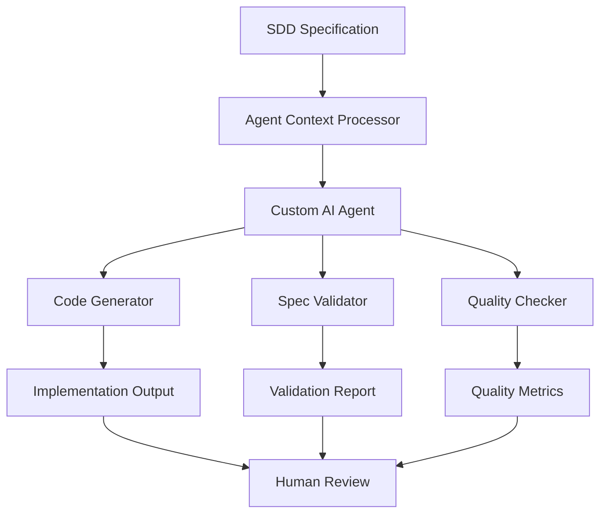

# Custom AI Agent Integration Templates

## Overview

This guide provides templates and patterns for integrating custom AI agents with Spec-Driven Development workflows. Whether you're building internal AI tools or integrating with specialized AI services, these templates will help you maintain SDD consistency and quality.

## Custom AI Agent Architecture

### Agent Integration Framework



### Core Integration Components

#### 1. Specification Parser
```python
# agents/spec_parser.py
import re
import yaml
from typing import Dict, List, Optional
from dataclasses import dataclass

@dataclass
class UserStory:
    id: str
    role: str
    action: str
    benefit: str
    acceptance_criteria: List[str]
    priority: str = "medium"
    
@dataclass
class TechnicalRequirement:
    id: str
    description: str
    constraints: List[str]
    dependencies: List[str]
    
class SpecificationParser:
    """Parse SDD specifications into structured data for AI agents"""
    
    def __init__(self, spec_directory: str):
        self.spec_directory = spec_directory
        
    def parse_requirements(self, file_path: str) -> List[UserStory]:
        """Extract user stories from requirements document"""
        with open(file_path, 'r') as f:
            content = f.read()
            
        user_stories = []
        
        # Regex pattern for user stories
        story_pattern = r'\*\*As a\*\* (.+?) \*\*I want\*\* (.+?) \*\*So that\*\* (.+?)(?=\n|\*\*)'
        ac_pattern = r'- WHEN (.+?) THEN (.+?) SHALL (.+?)(?=\n|$)'
        
        stories = re.findall(story_pattern, content, re.DOTALL)
        
        for i, (role, action, benefit) in enumerate(stories):
            # Extract acceptance criteria for this story
            story_section = self._extract_story_section(content, i)
            acceptance_criteria = re.findall(ac_pattern, story_section)
            
            user_story = UserStory(
                id=f"US{i+1:03d}",
                role=role.strip(),
                action=action.strip(),
                benefit=benefit.strip(),
                acceptance_criteria=[f"WHEN {when} THEN {then} SHALL {shall}" 
                                   for when, then, shall in acceptance_criteria]
            )
            user_stories.append(user_story)
            
        return user_stories
        
    def parse_technical_design(self, file_path: str) -> List[TechnicalRequirement]:
        """Extract technical requirements from design document"""
        with open(file_path, 'r') as f:
            content = f.read()
            
        # Implementation depends on your design document format
        # This is a template - customize based on your needs
        
        return []
        
    def _extract_story_section(self, content: str, story_index: int) -> str:
        """Extract the section of content related to a specific story"""
        # Implementation to isolate story section for AC extraction
        pass
```

## Custom Agent Implementation Examples

### 1. OpenAI-Based Custom Agent

```python
# agents/openai_agent.py
import openai
from typing import Dict, Any, List
import json

class OpenAISDDAgent(BaseAIAgent):
    """Custom AI agent using OpenAI API for SDD workflows"""
    
    def __init__(self, name: str, config: Dict[str, Any]):
        super().__init__(name, config)
        openai.api_key = config["openai_api_key"]
        self.model = config.get("model", "gpt-4")
        self.max_tokens = config.get("max_tokens", 2000)
        
    async def generate_code(self, task_context: Dict[str, Any]) -> str:
        """Generate code implementation for a specific task"""
        
        prompt = self._build_code_generation_prompt(task_context)
        
        response = await openai.ChatCompletion.acreate(
            model=self.model,
            messages=[
                {
                    "role": "system",
                    "content": "You are an expert software developer following Spec-Driven Development methodology. Generate high-quality, well-tested code that satisfies the given requirements."
                },
                {
                    "role": "user",
                    "content": prompt
                }
            ],
            max_tokens=self.max_tokens,
            temperature=0.1
        )
        
        generated_code = response.choices[0].message.content
        
        self.log_interaction("generate_code", task_context, generated_code)
        
        return generated_code
        
    def _build_code_generation_prompt(self, task_context: Dict[str, Any]) -> str:
        """Build comprehensive prompt for code generation"""
        
        current_task = task_context.get("current_task", {})
        requirements = task_context.get("related_requirements", [])
        design_info = task_context.get("relevant_design", {})
        
        prompt = f"""
        Generate code for the following task:
        
        Task: {current_task.get('description', 'No description provided')}
        Estimated Effort: {current_task.get('estimated_hours', 'Unknown')} hours
        Dependencies: {', '.join(current_task.get('dependencies', []))}
        
        Requirements to satisfy:
        {chr(10).join([f"- {req}" for req in requirements])}
        
        Technical Design Context:
        Architecture: {design_info.get('architecture', 'Not specified')}
        Technology Stack: {design_info.get('technology_stack', 'Not specified')}
        
        Requirements:
        1. Follow existing code patterns and conventions
        2. Include comprehensive error handling
        3. Add appropriate unit tests
        4. Include JSDoc/TypeDoc comments
        5. Ensure code is production-ready
        6. Satisfy all specified requirements
        
        Generate complete, working code with tests.
        """
        
        return prompt
```

### 2. Local LLM Agent (Ollama Integration)

```python
# agents/ollama_agent.py
import requests
import json
from typing import Dict, Any, List

class OllamaSDDAgent(BaseAIAgent):
    """Custom AI agent using local Ollama models for SDD workflows"""
    
    def __init__(self, name: str, config: Dict[str, Any]):
        super().__init__(name, config)
        self.base_url = config.get("ollama_url", "http://localhost:11434")
        self.model = config.get("model", "codellama")
        
    async def generate_code(self, task_context: Dict[str, Any]) -> str:
        """Generate code using local Ollama model"""
        
        prompt = self._build_code_generation_prompt(task_context)
        
        response = requests.post(
            f"{self.base_url}/api/generate",
            json={
                "model": self.model,
                "prompt": prompt,
                "stream": False,
                "options": {
                    "temperature": 0.1,
                    "top_p": 0.9,
                    "num_predict": 2000
                }
            }
        )
        
        if response.status_code == 200:
            result = response.json()
            generated_code = result.get("response", "")
            
            self.log_interaction("generate_code", task_context, generated_code)
            return generated_code
        else:
            raise Exception(f"Ollama API error: {response.status_code}")
```

## Configuration and Usage Examples

### Agent Configuration File

```yaml
# config/agents.yaml
agents:
  primary_generator:
    type: "openai"
    name: "GPT-4 Code Generator"
    config:
      openai_api_key: "${OPENAI_API_KEY}"
      model: "gpt-4"
      max_tokens: 2000
      temperature: 0.1
      
  local_validator:
    type: "ollama"
    name: "Local Spec Validator"
    config:
      ollama_url: "http://localhost:11434"
      model: "codellama"
      
coordinator:
  roles:
    spec_validator: "local_validator"
    code_generator: "primary_generator"
    
  workflow:
    parallel_reviews: true
    quality_threshold: 80
    auto_approve_threshold: 90
```

### Usage Example

```python
# main.py
import asyncio
import yaml
from agents.coordinator import AgentCoordinator, AgentRole
from agents.openai_agent import OpenAISDDAgent
from agents.ollama_agent import OllamaSDDAgent

async def main():
    # Load configuration
    with open("config/agents.yaml", 'r') as f:
        config = yaml.safe_load(f)
        
    # Initialize coordinator
    coordinator = AgentCoordinator(config["coordinator"])
    
    # Create and register agents
    openai_agent = OpenAISDDAgent("gpt4_generator", config["agents"]["primary_generator"]["config"])
    coordinator.register_agent(AgentRole.CODE_GENERATOR, openai_agent)
    
    ollama_agent = OllamaSDDAgent("local_validator", config["agents"]["local_validator"]["config"])
    coordinator.register_agent(AgentRole.SPEC_VALIDATOR, ollama_agent)
    
    # Execute SDD workflow
    result = await coordinator.execute_sdd_workflow(project_context)
    
    # Display results
    print("SDD Workflow Results:")
    print(f"Overall Status: {result['final_recommendation']['status']}")
    print(f"Score: {result['final_recommendation']['overall_score']}/100")

if __name__ == "__main__":
    asyncio.run(main())
```

## Best Practices for Custom Agent Integration

### 1. Agent Design Principles

- **Fail Gracefully**: Implement fallback mechanisms for when primary agents fail
- **Cache Expensive Operations**: Cache AI responses to improve performance and reduce costs
- **Rate Limiting**: Implement proper rate limiting to avoid API quota issues
- **Comprehensive Logging**: Log all interactions for debugging and improvement

### 2. Error Handling and Resilience

```python
class ResilientAgent(BaseAIAgent):
    """Agent with comprehensive error handling"""
    
    async def generate_code(self, task_context: Dict[str, Any]) -> str:
        """Generate code with robust error handling"""
        
        max_retries = 3
        retry_delay = 1  # seconds
        
        for attempt in range(max_retries):
            try:
                return await self._attempt_generation(task_context)
                
            except APIRateLimitError as e:
                if attempt < max_retries - 1:
                    wait_time = retry_delay * (2 ** attempt)  # Exponential backoff
                    self.logger.warning(f"Rate limit hit, waiting {wait_time}s before retry {attempt + 1}")
                    await asyncio.sleep(wait_time)
                else:
                    raise e
                    
            except Exception as e:
                if attempt < max_retries - 1:
                    self.logger.warning(f"Unexpected error, retrying: {e}")
                    await asyncio.sleep(retry_delay)
                else:
                    self.logger.error(f"All retry attempts failed: {e}")
                    raise e
```

## Resources and Next Steps

### Documentation and Examples
- Base Agent Interface Documentation
- OpenAI Integration Example
- Local LLM Integration Example
- Multi-Agent Coordination Example

### Community Resources
- **GitHub Repository**: Share your custom agent implementations
- **Discord Community**: Join SDD practitioners for agent development discussions
- **Documentation Wiki**: Contribute patterns and best practices
- **Example Gallery**: Browse community-contributed agent examples

### Advanced Topics
1. **Agent Learning and Adaptation**: Implement feedback loops for agent improvement
2. **Cross-Project Agent Sharing**: Build reusable agents for organizational use
3. **Agent Performance Optimization**: Advanced caching and optimization techniques
4. **Enterprise Agent Deployment**: Scaling agent infrastructure for large teams