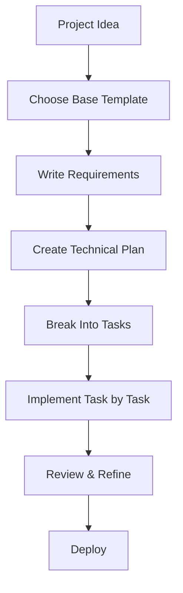
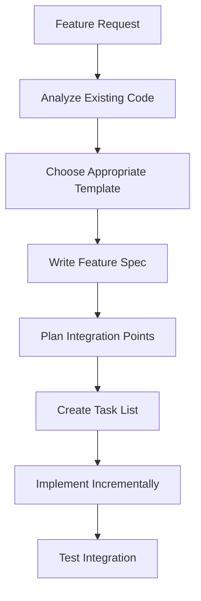
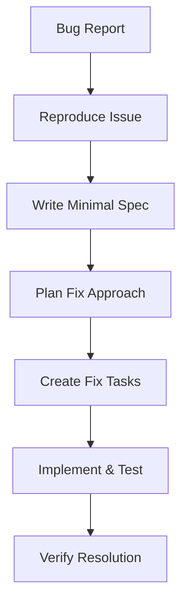

# Getting Started with Spec-Driven Development

## Quick Start Workflow

This guide provides a streamlined path to implementing your first Spec-Driven Development (SDD) workflow. Follow these steps to move from idea to implementation with structured, AI-consumable specifications.

## Prerequisites

- Basic understanding of software development workflows
- Access to an AI coding assistant (GitHub Copilot, Claude, Cursor, etc.)
- Git repository for your project
- Text editor or IDE

## 5-Step Quick Start

This **step-by-step** guide will walk you through creating your **first spec** with practical examples and actionable guidance.

### Step 1: Choose Your Template

Select the appropriate template based on your project type:

- **New Feature**: Use `resources/templates/base/spec.md`
- **API Development**: Use `resources/templates/api/spec.md`
- **Frontend Component**: Use `resources/templates/frontend/spec.md`
- **Backend Service**: Use `resources/templates/backend/spec.md`

### Step 2: Define Your Requirements

1. Copy your chosen template to your project directory
2. Fill in the user story section with clear role-based requirements
3. Write acceptance criteria using EARS format (Easy Approach to Requirements Syntax)

**Example** of a well-structured user story:
```markdown
**User Story:** As a user, I want to authenticate with email and password, so that I can access my personal dashboard.

#### Acceptance Criteria
1. WHEN a user enters valid credentials THEN the system SHALL authenticate and redirect to dashboard
2. WHEN a user enters invalid credentials THEN the system SHALL display an error message
3. IF a user fails authentication 3 times THEN the system SHALL temporarily lock the account
```

### Step 3: Create Your Technical Plan

1. Copy `resources/templates/base/plan.md` to your project
2. Document your technical approach and architecture decisions
3. Identify key components and their interactions
4. Note any constraints or assumptions

### Step 4: Break Down Into Tasks

1. Copy `resources/templates/base/tasks.md` to your project
2. Convert your plan into specific, actionable coding tasks
3. Reference requirements in each task using `_Requirements: [reference]_`
4. Ensure each task is small enough to complete in one session

### Step 5: Implement with AI Assistance

1. Share your spec, plan, and current task with your AI assistant
2. Ask the AI to implement the specific task you're working on
3. Review and refine the generated code
4. Mark tasks as complete and move to the next one

## Common Workflows

### Greenfield Project Workflow



### Feature Addition Workflow



### Bug Fix Workflow



## Best Practices

### Writing Effective Specs

- **Be Specific**: Avoid vague language like "user-friendly" or "fast"
- **Include Edge Cases**: Think about error conditions and boundary cases
- **Make It Testable**: Each requirement should be verifiable
- **Keep It Focused**: One spec per feature or component

### Working with AI Assistants

- **Provide Context**: Share the full spec, not just the current task
- **Be Iterative**: Start with basic implementation, then refine
- **Review Everything**: AI-generated code needs human oversight
- **Ask Questions**: Use AI to clarify requirements or suggest alternatives

### Task Management

- **Small Batches**: Keep tasks to 1-2 hours of work maximum
- **Sequential Dependencies**: Ensure tasks build on each other logically
- **Clear Acceptance**: Each task should have obvious completion criteria
- **Reference Requirements**: Always trace tasks back to original requirements

## Troubleshooting Quick Fixes

### "My spec is too vague"
- Add specific examples and scenarios
- Use the EARS format for acceptance criteria
- Include input/output examples where applicable

### "Tasks are too big"
- Break large tasks into smaller sub-tasks
- Focus on one component or function at a time
- Create separate tasks for implementation and testing

### "AI doesn't understand my requirements"
- Add more context about the business domain
- Include examples of similar functionality
- Clarify technical constraints and assumptions

### "Implementation doesn't match spec"
- Review the spec with your AI assistant
- Ask the AI to explain its interpretation
- Refine the spec based on implementation learnings

## Next Steps

Once you've completed your first SDD workflow:

1. **Review Results**: Compare final implementation to original requirements
2. **Refine Process**: Note what worked well and what could be improved
3. **Explore Advanced Patterns**: Check out `how-to/advanced-flows.md`
4. **Integrate Tools**: Set up GitHub Spec Kit or other AI integrations
5. **Share Learnings**: Contribute improvements back to the community

## Resources

- [Advanced Workflows](advanced-flows.md) - Complex integration scenarios
- [AI Integration Guide](ai-integration.md) - Multi-tool setup and optimization
- [Troubleshooting Guide](troubleshooting.md) - Common issues and solutions
- [Templates Directory](../resources/templates/) - All available templates
- [Training Materials](../training/) - Structured learning paths