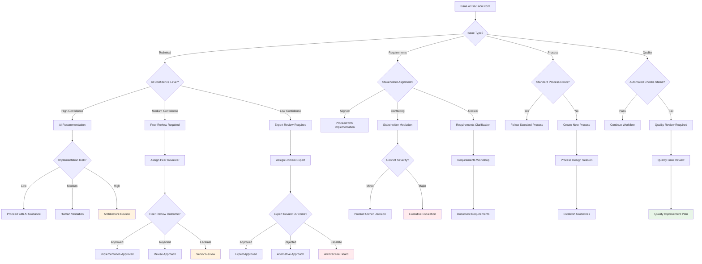
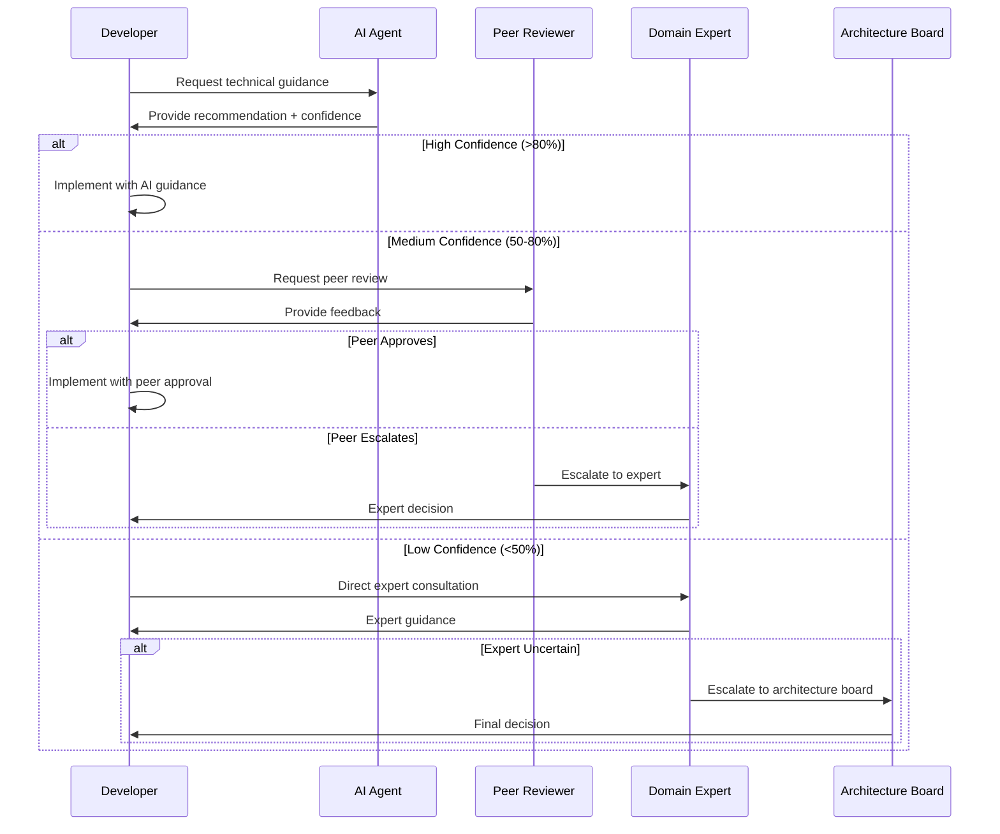
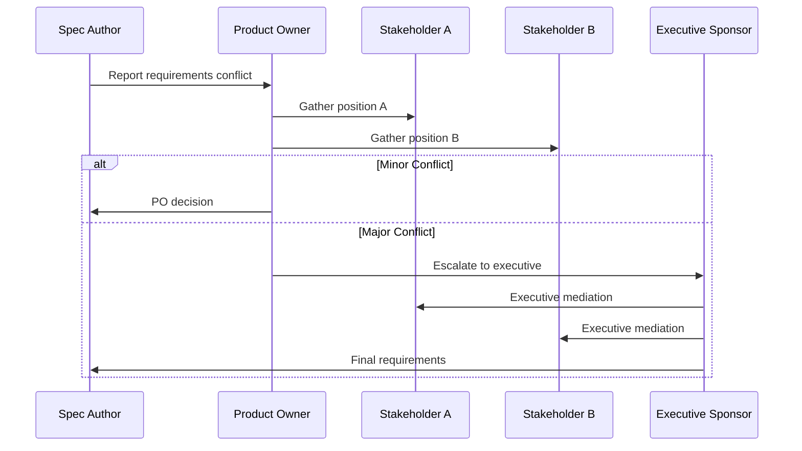

# Escalation Framework Decision Tree

## Human Reviewer Involvement and Decision Escalation

This decision tree guides when and how to involve human reviewers in the SDD process and escalate decisions appropriately.



## Escalation Triggers

### Technical Escalation Triggers

**Immediate Escalation Required:**
- [ ] Security vulnerability identified
- [ ] Data loss or corruption risk
- [ ] System availability impact > 4 hours
- [ ] Compliance violation potential
- [ ] Architecture standard violation

**Peer Review Triggers:**
- [ ] AI confidence score < 70%
- [ ] Complex algorithm implementation
- [ ] Performance optimization needs
- [ ] Integration with unfamiliar systems
- [ ] Code review feedback conflicts

**Expert Review Triggers:**
- [ ] New technology adoption
- [ ] Architectural pattern changes
- [ ] Cross-system integration design
- [ ] Performance bottleneck solutions
- [ ] Security implementation decisions

### Requirements Escalation Triggers

**Stakeholder Mediation Required:**
- [ ] Conflicting business requirements
- [ ] Scope creep beyond 20% of original estimate
- [ ] Timeline impact > 1 sprint
- [ ] Resource allocation conflicts
- [ ] Success criteria disagreements

**Requirements Clarification Needed:**
- [ ] Ambiguous acceptance criteria
- [ ] Missing edge case definitions
- [ ] Unclear user story priorities
- [ ] Incomplete dependency information
- [ ] Undefined error handling requirements

### Quality Escalation Triggers

**Quality Gate Failures:**
- [ ] Automated quality score < 60%
- [ ] Multiple review cycles without resolution
- [ ] Persistent template compliance issues
- [ ] Cross-reference validation failures
- [ ] Requirement traceability gaps

**Process Improvement Needed:**
- [ ] Recurring quality issues
- [ ] Review bottlenecks identified
- [ ] Tool effectiveness concerns
- [ ] Training gap identification
- [ ] Workflow optimization opportunities

## Escalation Levels and Responsibilities

### Level 1: Peer Review
**Participants:**
- Spec author
- Peer developer (same team)
- Optional: Senior team member

**Authority:**
- Approve/reject technical approaches
- Suggest alternative implementations
- Identify additional requirements
- Escalate to Level 2 if needed

**Timeline:** 1-2 business days

**Escalation Criteria:**
- Technical complexity beyond team expertise
- Cross-team coordination required
- Architecture implications identified
- Disagreement on approach

### Level 2: Expert/Senior Review
**Participants:**
- Domain expert or senior engineer
- Tech lead or architect
- Product owner (for requirements issues)
- QA lead (for quality concerns)

**Authority:**
- Make technical architecture decisions
- Resolve cross-team conflicts
- Approve new technology adoption
- Define quality standards
- Escalate to Level 3 if needed

**Timeline:** 2-3 business days

**Escalation Criteria:**
- Organization-wide impact
- Significant resource requirements
- Policy or standard changes needed
- Executive decision required

### Level 3: Architecture Board/Executive
**Participants:**
- Chief Architect or CTO
- Engineering Director
- Product Director
- Security Officer (if applicable)
- Executive sponsor

**Authority:**
- Set organizational standards
- Approve major architecture changes
- Allocate significant resources
- Make policy decisions
- Resolve executive-level conflicts

**Timeline:** 1 week maximum

**Final Authority:** No further escalation

## Escalation Process Workflows

### Technical Issue Escalation


### Requirements Conflict Resolution


## Decision Authority Matrix

| Decision Type | Level 1 (Peer) | Level 2 (Expert) | Level 3 (Executive) |
|---------------|-----------------|------------------|---------------------|
| Code implementation approach | ✅ Approve | ✅ Override | ✅ Final Authority |
| Technology choice (existing stack) | ✅ Recommend | ✅ Approve | ✅ Override |
| New technology adoption | ❌ | ✅ Recommend | ✅ Approve |
| Architecture changes (minor) | ❌ | ✅ Approve | ✅ Override |
| Architecture changes (major) | ❌ | ✅ Recommend | ✅ Approve |
| Requirements clarification | ✅ Suggest | ✅ Approve | ✅ Override |
| Scope changes (<20%) | ✅ Recommend | ✅ Approve | ✅ Override |
| Scope changes (>20%) | ❌ | ✅ Recommend | ✅ Approve |
| Quality standards | ❌ | ✅ Set | ✅ Override |
| Process changes | ❌ | ✅ Recommend | ✅ Approve |

## Communication Templates

### Escalation Request Template
```markdown
## Escalation Request

**Issue Type:** [Technical/Requirements/Quality/Process]
**Urgency:** [Low/Medium/High/Critical]
**Current Status:** [Brief description]

### Problem Description
[Detailed description of the issue requiring escalation]

### Context
- **Spec/Project:** [Link to relevant spec]
- **Stakeholders:** [List of involved parties]
- **Timeline Impact:** [Potential delays or blockers]
- **Previous Attempts:** [What has been tried already]

### Requested Decision/Action
[Specific decision or action needed from reviewer]

### Options Considered
1. **Option A:** [Description, pros, cons]
2. **Option B:** [Description, pros, cons]
3. **Option C:** [Description, pros, cons]

### Recommendation
[If applicable, author's recommended approach]

### Impact Assessment
- **Technical Impact:** [System/architecture implications]
- **Business Impact:** [Timeline, cost, scope implications]
- **Risk Assessment:** [Potential risks and mitigation strategies]

### Required Response Timeline
[When decision is needed and why]
```

### Escalation Response Template
```markdown
## Escalation Response

**Decision:** [Approved/Rejected/Modified/Further Escalation Required]
**Decision Date:** [Date]
**Decision Maker:** [Name and role]

### Decision Rationale
[Explanation of the decision and reasoning]

### Approved Approach
[If approved, specific approach to implement]

### Conditions/Requirements
[Any conditions or requirements for implementation]

### Follow-up Actions
- [ ] [Specific action items with owners and timelines]
- [ ] [Additional reviews or approvals needed]
- [ ] [Documentation or communication requirements]

### Monitoring/Review Points
[How success will be measured and when to review]
```

## Escalation Metrics and Monitoring

### Key Performance Indicators
**Escalation Volume:**
- Number of escalations per week/month
- Escalation rate by project type/complexity
- Escalation distribution across levels

**Resolution Efficiency:**
- Average time to resolution by level
- Escalation success rate (resolved vs. re-escalated)
- Decision quality (post-implementation validation)

**Process Health:**
- Percentage of issues resolved at appropriate level
- Escalation accuracy (appropriate level selection)
- Stakeholder satisfaction with escalation process

### Continuous Improvement

**Monthly Reviews:**
- Analyze escalation patterns and trends
- Identify process bottlenecks or gaps
- Review decision quality and outcomes
- Gather feedback from participants

**Quarterly Assessments:**
- Evaluate escalation criteria effectiveness
- Update authority matrix based on outcomes
- Refine communication templates
- Adjust timeline expectations

**Annual Framework Review:**
- Comprehensive process evaluation
- Stakeholder feedback collection
- Best practice identification and sharing
- Framework updates and improvements

## Common Escalation Scenarios

### Scenario 1: AI Uncertainty on Complex Algorithm
**Trigger:** AI confidence < 50% on performance-critical algorithm
**Path:** Developer → Domain Expert → Architecture Board (if needed)
**Timeline:** 2-3 days for expert review, +1 week if board review needed

### Scenario 2: Conflicting Stakeholder Requirements
**Trigger:** Two departments have incompatible requirements
**Path:** Spec Author → Product Owner → Executive Sponsor
**Timeline:** 1 day for PO mediation, +3-5 days for executive resolution

### Scenario 3: Security Concern Identification
**Trigger:** Potential security vulnerability in proposed approach
**Path:** Immediate escalation to Security Officer + Architecture Board
**Timeline:** Same day notification, 24-48 hours for resolution

### Scenario 4: Quality Gate Persistent Failures
**Trigger:** Spec fails quality gates after 3 revision cycles
**Path:** Author → Quality Lead → Process Improvement Team
**Timeline:** 1-2 days for quality review, +1 week for process improvement

### Scenario 5: New Technology Adoption Request
**Trigger:** Team wants to use technology not in approved stack
**Path:** Team Lead → Architecture Board → CTO (if significant)
**Timeline:** 1 week for architecture review, +1 week for executive approval if needed