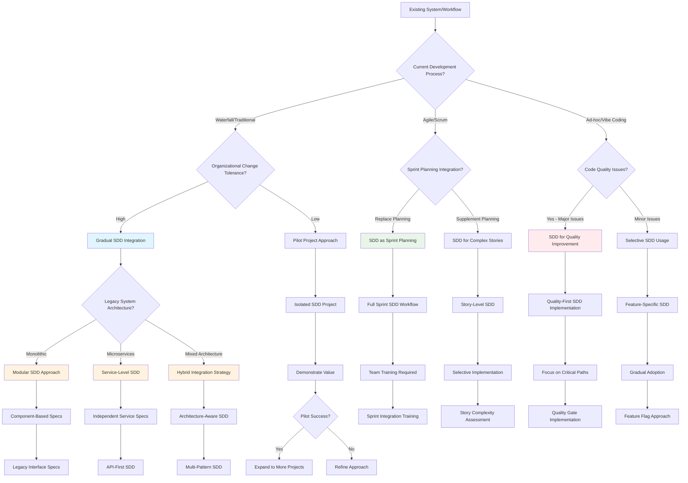
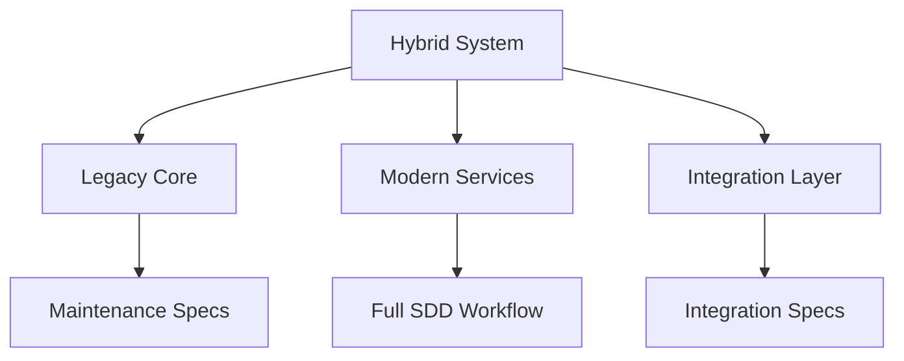
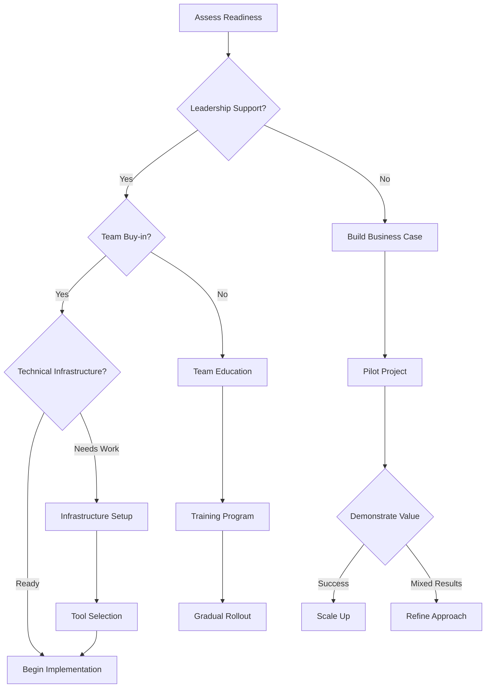

# Integration Strategy Decision Tree

## Legacy System Integration and Hybrid Workflows

This **decision tree** guides teams through integrating Spec-Driven Development with existing systems and workflows. It provides **decision points** for choosing the right **integration options** and understanding **trade-offs** between different approaches.

## Integration Patterns

### Pattern 1: Gradual Replacement
**Best for:** Teams with existing documentation processes
**Approach:**
- Replace existing documentation with SDD specs
- Maintain current development workflow initially
- Gradually introduce AI-assisted implementation
- Measure improvement in quality and velocity

### Pattern 2: Agile Integration
**Best for:** Scrum/Kanban teams
**Approach:**
- Use SDD for sprint planning and story refinement
- Replace user story templates with spec templates
- Integrate AI agents into development workflow
- Maintain sprint cadence and ceremonies

### Pattern 3: Quality-First Implementation
**Best for:** Teams with technical debt or quality issues
**Approach:**
- Start with critical bug fixes and new features
- Use SDD to improve requirement clarity
- Focus on testing and validation improvements
- Gradually expand to maintenance work

### Pattern 4: Architecture-Driven Integration
**Best for:** Complex systems with multiple components
**Approach:**
- Map SDD to existing architecture patterns
- Create service-specific or component-specific specs
- Maintain architectural boundaries in spec organization
- Use SDD for cross-service integration planning

## Legacy System Considerations

### Monolithic Applications

**Challenges:**
- Tight coupling between components
- Shared databases and state
- Large, complex codebases
- Resistance to change

**SDD Strategies:**
- Focus on new feature development
- Create specs for major modules or subsystems
- Use SDD for API design and documentation
- Plan refactoring with architectural specs

### Microservices Architecture

**Advantages:**
- Natural boundaries for spec organization
- Independent development and deployment
- Clear API contracts and interfaces
- Easier to adopt SDD incrementally

**SDD Strategies:**
- One spec per service or bounded context
- Focus on API-first development
- Use SDD for service integration planning
- Coordinate cross-service features with umbrella specs

### Hybrid Architectures

**Complexity Factors:**
- Multiple technology stacks
- Different development practices per component
- Complex integration requirements
- Varying team expertise levels

**SDD Strategies:**
- Tailor approach to each component type
- Focus on integration points and APIs
- Use SDD for modernization planning
- Create migration roadmaps with specs

## Workflow Integration Strategies

### Sprint Planning Integration
1. **Story Refinement**: Use spec templates for complex stories
2. **Acceptance Criteria**: Replace traditional AC with EARS format
3. **Technical Planning**: Create plan.md for architectural decisions
4. **Task Breakdown**: Use SDD task templates for implementation

### Code Review Integration
1. **Spec Review**: Review specs before implementation
2. **Implementation Validation**: Verify code matches spec requirements
3. **Documentation Updates**: Keep specs synchronized with code changes
4. **Quality Gates**: Use SDD checklists in review process

### CI/CD Integration
1. **Spec Validation**: Automated checking of spec completeness
2. **Requirement Traceability**: Link commits to spec requirements
3. **Documentation Generation**: Auto-generate docs from specs
4. **Quality Metrics**: Track spec coverage and implementation alignment

## Change Management Strategies

### Organizational Readiness Assessment

### Implementation Timeline
**Phase 1: Foundation (Weeks 1-4)**
- Tool setup and configuration
- Team training and onboarding
- Template customization
- Pilot project selection

**Phase 2: Pilot (Weeks 5-12)**
- Implement SDD on selected project
- Gather feedback and metrics
- Refine processes and templates
- Document lessons learned

**Phase 3: Expansion (Weeks 13-24)**
- Roll out to additional teams/projects
- Establish governance and standards
- Create internal champions
- Measure organizational impact

**Phase 4: Optimization (Ongoing)**
- Continuous improvement based on feedback
- Advanced feature adoption
- Cross-team collaboration enhancement
- ROI measurement and reporting

## Success Metrics

### Technical Metrics
- **Requirement Clarity**: Reduction in clarification requests
- **Code Quality**: Decreased bug rates and technical debt
- **Development Velocity**: Faster feature delivery
- **Documentation Coverage**: Improved spec-to-code alignment

### Process Metrics
- **Team Adoption**: Percentage of projects using SDD
- **Training Completion**: Team member certification rates
- **Tool Usage**: AI agent utilization and effectiveness
- **Feedback Scores**: Team satisfaction with SDD process

### Business Metrics
- **Time to Market**: Reduced feature delivery time
- **Quality Improvements**: Fewer production issues
- **Team Productivity**: Increased story points per sprint
- **Stakeholder Satisfaction**: Improved requirement alignment

## Common Integration Challenges

### Technical Challenges
- **Tool Compatibility**: Existing tools may not integrate well
- **Legacy Code**: Difficult to apply SDD to existing codebase
- **Performance Impact**: Additional overhead from spec creation
- **Learning Curve**: Time investment for team training

### Organizational Challenges
- **Resistance to Change**: Team members prefer existing processes
- **Resource Allocation**: Time and budget for training and tools
- **Process Conflicts**: SDD may conflict with existing methodologies
- **Measurement Difficulties**: Hard to quantify SDD benefits initially

### Mitigation Strategies
1. **Start Small**: Begin with willing teams and simple projects
2. **Show Value Early**: Focus on quick wins and visible improvements
3. **Provide Support**: Offer training, mentoring, and resources
4. **Measure Progress**: Track metrics and celebrate successes
5. **Iterate Quickly**: Adapt approach based on feedback and results