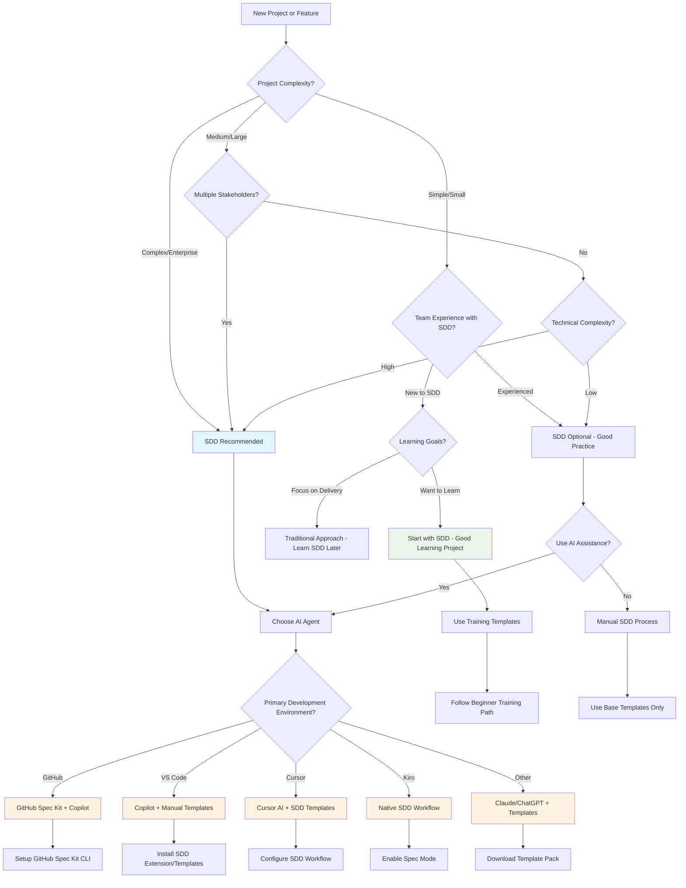

# Project Initiation Decision Tree

## When to Use Spec-Driven Development

This decision tree helps teams determine when and how to implement Spec-Driven Development for their projects.

## Decision Criteria

### Project Complexity Assessment

**Simple/Small Projects:**
- Single developer or small team (2-3 people)
- Well-understood requirements
- Short timeline (< 2 weeks)
- Minimal external dependencies

**Medium/Large Projects:**
- Multiple developers (4-10 people)
- Some uncertainty in requirements
- Medium timeline (2-8 weeks)
- Several external integrations

**Complex/Enterprise Projects:**
- Large teams (10+ people)
- High uncertainty or changing requirements
- Long timeline (2+ months)
- Multiple systems and stakeholders

### Team Experience Levels

**Experienced with SDD:**
- Team has used spec-driven approaches before
- Familiar with AI-assisted development
- Comfortable with structured planning

**New to SDD:**
- Traditional development background
- Limited experience with AI coding tools
- Learning new methodologies

### AI Agent Selection Criteria

**GitHub Spec Kit + Copilot:**
- Best for: GitHub-native workflows
- Strengths: Integrated experience, slash commands
- Requirements: GitHub repository, Copilot subscription

**Cursor AI + SDD Templates:**
- Best for: AI-first development experience
- Strengths: Advanced AI capabilities, context awareness
- Requirements: Cursor IDE, template setup

**Kiro Native SDD:**
- Best for: Full SDD lifecycle management
- Strengths: Built-in spec workflow, task management
- Requirements: Kiro IDE access

**Claude/ChatGPT + Templates:**
- Best for: Flexible, tool-agnostic approach
- Strengths: Works with any editor, customizable
- Requirements: AI service access, manual template management

## Implementation Paths

### Path 1: Full SDD with AI Agent
1. Set up chosen AI development environment
2. Initialize project with SDD templates
3. Follow complete spec → plan → tasks → implementation workflow
4. Use AI for code generation and review

### Path 2: Lightweight SDD
1. Use basic spec and task templates
2. Manual planning and implementation
3. Optional AI assistance for specific tasks
4. Focus on documentation and structured approach

### Path 3: Learning-Focused SDD
1. Start with training materials and guided tutorials
2. Use simplified templates for first project
3. Gradually adopt more advanced SDD practices
4. Build team expertise over multiple projects

### Path 4: Hybrid Approach
1. Use SDD for planning and architecture
2. Traditional development for implementation
3. Gradual adoption of AI-assisted coding
4. Evaluate and expand SDD usage over time

## Next Steps

After using this decision tree:

1. **Document Your Choice**: Record the decision rationale for future reference
2. **Set Up Tools**: Follow the specific setup guide for your chosen path
3. **Start Small**: Begin with a pilot project or feature
4. **Gather Feedback**: Collect team feedback and iterate on the approach
5. **Scale Gradually**: Expand SDD usage based on success and team comfort