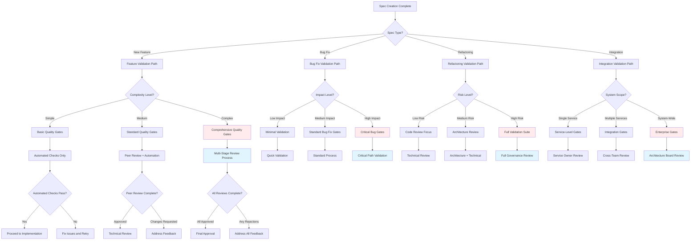
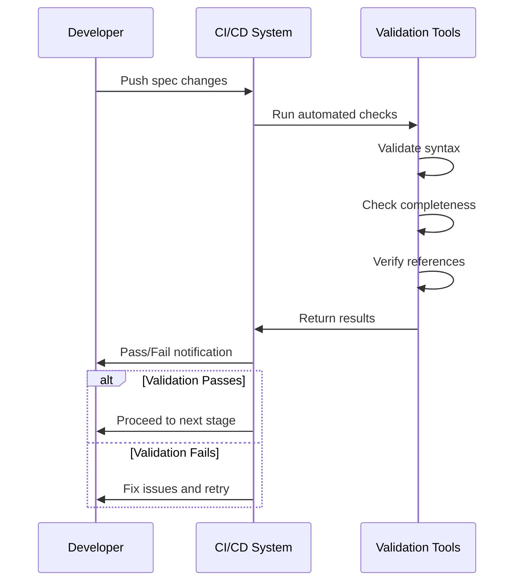
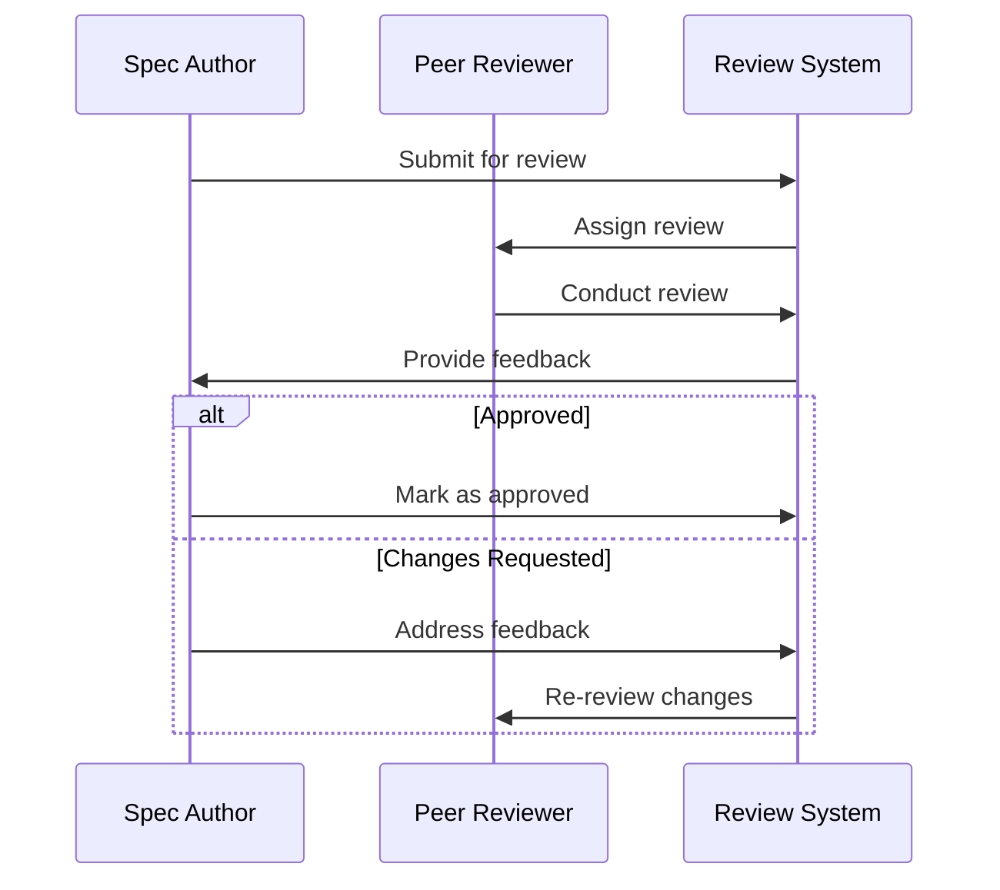
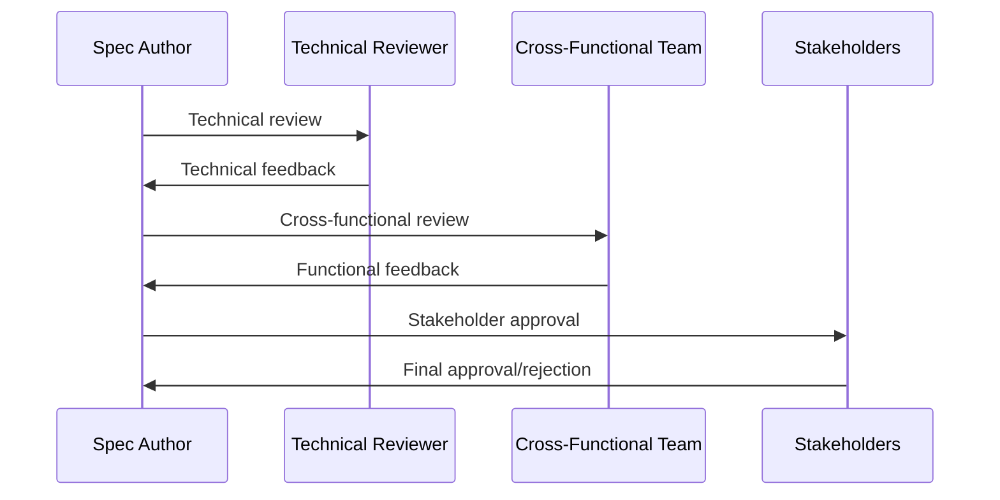

# Validation Gates Decision Tree

## Spec Quality Gates and Review Checkpoints

This decision tree helps teams establish appropriate validation checkpoints throughout the SDD workflow.



## Quality Gate Definitions

### Basic Quality Gates (Simple Features)
**Automated Checks:**
- [ ] Spec template completeness
- [ ] Markdown syntax validation
- [ ] Requirement format compliance (EARS)
- [ ] Link and reference validation

**Criteria for Passage:**
- All required sections completed
- Clear user stories and acceptance criteria
- No syntax or formatting errors
- Estimated effort < 1 week

### Standard Quality Gates (Medium Complexity)
**Automated Checks:**
- [ ] All basic quality gate checks
- [ ] Cross-reference validation
- [ ] Dependency analysis
- [ ] Template compliance scoring

**Peer Review Checklist:**
- [ ] Requirements clarity and completeness
- [ ] Technical approach feasibility
- [ ] Edge case coverage
- [ ] Testing strategy adequacy
- [ ] Security considerations addressed

**Review Participants:**
- Primary developer
- One peer reviewer
- Optional: Domain expert

### Comprehensive Quality Gates (Complex Features)
**Multi-Stage Review Process:**

**Stage 1: Technical Review**
- [ ] Architecture alignment
- [ ] Performance implications
- [ ] Security assessment
- [ ] Scalability considerations
- [ ] Integration impact analysis

**Stage 2: Cross-Functional Review**
- [ ] Product requirements alignment
- [ ] UX/UI considerations
- [ ] QA testability assessment
- [ ] DevOps deployment impact
- [ ] Documentation completeness

**Stage 3: Stakeholder Approval**
- [ ] Business value validation
- [ ] Resource allocation approval
- [ ] Timeline feasibility
- [ ] Risk assessment acceptance
- [ ] Success metrics agreement

## Validation Checklists

### Spec Completeness Checklist
```markdown
## Required Sections
- [ ] Overview with clear problem statement
- [ ] User stories in proper format
- [ ] Acceptance criteria using EARS syntax
- [ ] Non-functional requirements specified
- [ ] Dependencies identified and documented
- [ ] Success metrics defined
- [ ] Out of scope items listed

## Quality Indicators
- [ ] Requirements are testable and measurable
- [ ] Edge cases and error scenarios covered
- [ ] Security and privacy considerations addressed
- [ ] Performance requirements specified
- [ ] Accessibility requirements included
```

### Technical Review Checklist
```markdown
## Architecture and Design
- [ ] Solution aligns with system architecture
- [ ] Technology choices are justified
- [ ] Integration points are well-defined
- [ ] Data models are appropriate
- [ ] API design follows standards

## Implementation Feasibility
- [ ] Technical approach is sound
- [ ] Complexity is appropriately estimated
- [ ] Dependencies are available and stable
- [ ] Team has required expertise
- [ ] Timeline is realistic

## Risk Assessment
- [ ] Technical risks identified and mitigated
- [ ] Performance bottlenecks considered
- [ ] Security vulnerabilities addressed
- [ ] Scalability limitations understood
- [ ] Fallback plans defined
```

### Cross-Functional Review Checklist
```markdown
## Product Alignment
- [ ] Meets business requirements
- [ ] Aligns with product roadmap
- [ ] User experience is considered
- [ ] Accessibility requirements met
- [ ] Internationalization needs addressed

## Quality Assurance
- [ ] Testing strategy is comprehensive
- [ ] Test scenarios cover all requirements
- [ ] Performance testing plan included
- [ ] Security testing requirements defined
- [ ] Acceptance criteria are testable

## Operations and Deployment
- [ ] Deployment strategy is defined
- [ ] Monitoring and alerting planned
- [ ] Rollback procedures documented
- [ ] Infrastructure requirements specified
- [ ] Maintenance procedures outlined
```

## Review Process Workflows

### Automated Validation Workflow


### Peer Review Workflow


### Multi-Stage Review Workflow


## Quality Metrics and Thresholds

### Automated Quality Scores
**Completeness Score (0-100):**
- Required sections present: 40 points
- Acceptance criteria quality: 30 points
- Dependency documentation: 20 points
- Success metrics defined: 10 points

**Minimum Threshold:** 80/100 for automated approval

**Clarity Score (0-100):**
- Readability metrics: 25 points
- Consistent terminology: 25 points
- Clear user stories: 25 points
- Unambiguous requirements: 25 points

**Minimum Threshold:** 75/100 for automated approval

### Review Quality Indicators
**Review Effectiveness Metrics:**
- Time to complete review
- Number of issues found
- Reviewer agreement rate
- Post-implementation defect correlation

**Review Coverage Metrics:**
- Percentage of requirements reviewed
- Number of reviewers per complexity level
- Cross-functional participation rate
- Stakeholder approval rate

## Escalation Criteria

### When to Escalate to Architecture Review
- [ ] New technology introduction
- [ ] Significant performance implications
- [ ] Cross-system integration requirements
- [ ] Security or compliance concerns
- [ ] Scalability or capacity planning needs

### When to Escalate to Business Stakeholders
- [ ] Scope changes affecting timeline/budget
- [ ] Requirements conflicts or ambiguity
- [ ] Resource allocation needs
- [ ] Risk tolerance decisions
- [ ] Success criteria disagreements

### When to Escalate to Senior Technical Leadership
- [ ] Technical feasibility concerns
- [ ] Architecture standard violations
- [ ] Significant technical debt implications
- [ ] Team capability or capacity issues
- [ ] Technology strategy alignment questions

## Continuous Improvement

### Review Process Metrics
**Efficiency Metrics:**
- Average review cycle time
- Review bottleneck identification
- Reviewer workload distribution
- Automation effectiveness rate

**Quality Metrics:**
- Defect escape rate from reviews
- Post-implementation requirement changes
- Stakeholder satisfaction scores
- Implementation success rate

### Process Optimization
**Regular Assessment:**
- Monthly review process retrospectives
- Quarterly quality gate effectiveness analysis
- Annual validation framework review
- Continuous feedback collection and analysis

**Improvement Actions:**
- Refine quality gate criteria based on outcomes
- Adjust review complexity based on project success
- Update checklists based on common issues
- Enhance automation based on manual review patterns